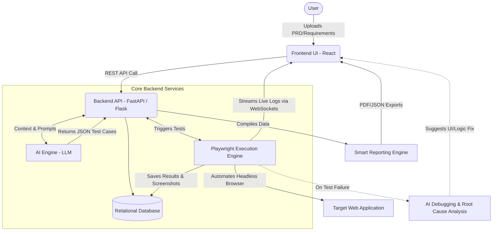
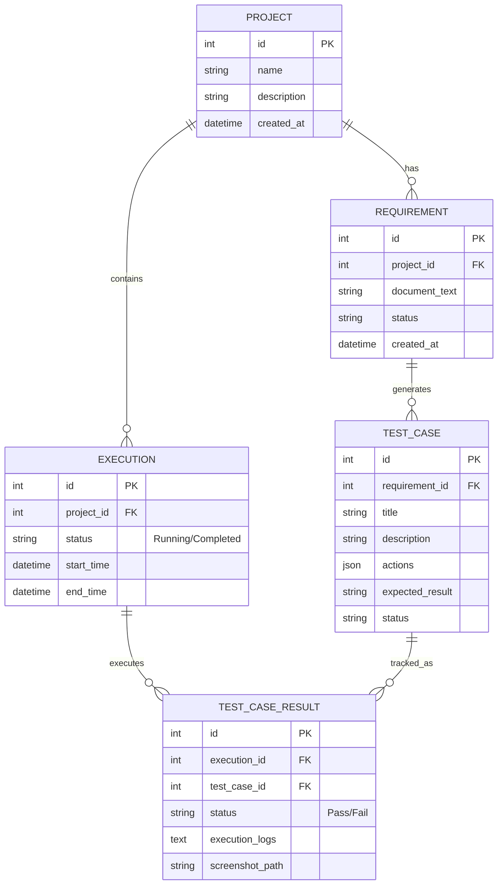
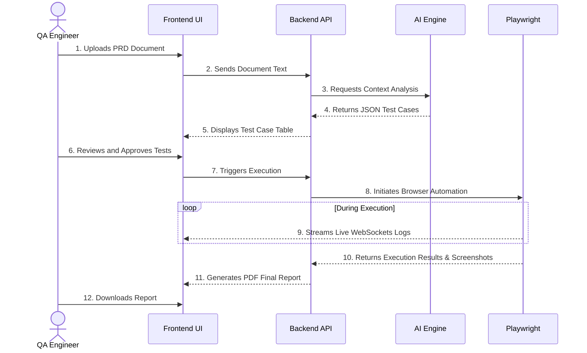

# AutoQA Enterprise - Final Project Documentation

## 1. Project Overview
AutoQA Enterprise is an advanced, end-to-end Artificial Intelligence (AI) driven Software Testing Life Cycle (STLC) platform. It was engineered to bridge the gap between rapid software development and quality assurance bottlenecks. By utilizing cutting-edge Large Language Models (LLMs) alongside dynamic browser automation tools, AutoQA Enterprise autonomously handles everything from requirement analysis to test case generation, live execution, and comprehensive reporting, all without requiring the user to write a single line of code.

## 2. Problem Statement
In the era of Agile methodologies and Continuous Integration/Continuous Deployment (CI/CD), software iterations are deployed daily or even hourly. However, traditional Quality Assurance processes are fraught with challenges:
- **Manual Translation Bottleneck:** QA Engineers spend a significant portion of their time manually reading Product Requirement Documents (PRDs) or Jira tickets to formulate test scenarios.
- **Script Fragility:** Traditional UI automation frameworks rely on hardcoded locators (XPath, CSS selectors). When developers change a UI element, scripts break, leading to a massive maintenance overhead.
- **Lack of Actionable Feedback:** When a test fails in a traditional CI pipeline, engineers often receive generic error codes, requiring them to manually investigate logs, recreate the state, and diagnose the issue.

## 3. Proposed Solution
AutoQA Enterprise solves these problems through a holistic, AI-first approach:
1. **Intelligent Ingestion:** Users upload raw requirements (PDFs, text). The AI reads and understands the business logic.
2. **Autonomous Test Design:** The system automatically generates structured, comprehensive test cases, predicting negative scenarios and edge cases.
3. **Dynamic Execution:** Rather than statically compiling scripts, the backend translates test scenarios into Playwright automation commands on the fly.
4. **Self-Healing & Debugging:** When an automation step fails, the exact DOM context and error trace are sent back to the AI to provide immediate, actionable debugging insights.

---

## 4. System Architecture

The application is built on a decoupled, microservice-inspired architecture ensuring scalability and real-time responsiveness.

### Architecture Components
- **Frontend Layer:** Built with React and Vite, utilizing Tailwind CSS for styling. It manages user state, handles document uploads, and connects to WebSockets to display live streaming logs during test execution.
- **API & Orchestration Layer:** Python-based REST API that routes requests, manages database transactions via SQLAlchemy, and acts as the bridge between the UI, the AI, and the execution runner.
- **AI Processing Layer:** Communicates with LLMs to process unstructured text and convert it into strictly typed JSON schemas that the system can predictably parse.
- **Execution Layer:** A Python Playwright wrapper that reads the JSON test definitions, maps them to browser actions (click, fill, navigate), captures screenshots per step, and records performance metrics.

---

## 5. Entity-Relationship Diagram (ERD)

The database is structured to maintain relational integrity across projects, requirements, tests, and execution history.

---

## 6. Core Modules

### 6.1 Data Center & AI Analysis
Serves as the knowledge base. Users upload their project requirements. The backend sanitizes the text and uses a custom prompt chain to ask the AI to act as a Senior QA Engineer, identifying core features, user roles, and extracting both positive and negative test paths.

### 6.2 Test Case Generation & Validation Console
The AI outputs tests into a strict JSON format (actions, inputs, expected results). The frontend renders this data into an interactive data table. The Human-in-the-Loop (HITL) concept is applied here: engineers review the AI's work and approve or modify the tests before they are committed to the execution queue.

### 6.3 Playwright Execution Engine & Dashboard
When an execution is triggered, the engine spawns a Chromium browser instance. It dynamically loops through the JSON `actions` array. If an action is `click`, it finds the element and clicks. If `type`, it inputs text. 
**Real-Time Monitoring:** As the Python engine executes, it emits log events over WebSockets. The React frontend intercepts these and displays a scrolling terminal, allowing users to watch the test progress live.

### 6.4 Visual Workflow Builder
A drag-and-drop canvas (using libraries like React Flow) that allows users to string together modular test cases into complex, end-to-end integration workflows. This is critical for testing multi-stage user journeys (e.g., Login -> Add to Cart -> Checkout).

### 6.5 Smart Reporting & Artifact Generation
Upon completion, the system aggregates the `TEST_CASE_RESULT` data. It compiles execution durations, pass percentages, and failure logs into a downloadable, branded PDF report. Screenshots taken by Playwright at the point of failure are embedded directly into the report.

---

## 7. Technology Stack

| Component | Technology | Rationale |
| :--- | :--- | :--- |
| **Frontend Framework** | React.js (Vite) | High performance, component-based UI, fast HMR. |
| **Styling** | Tailwind CSS | Utility-first CSS for rapid, responsive UI development. |
| **Backend Language** | Python 3.10+ | Excellent ecosystem for AI, scripting, and automation. |
| **Backend Framework** | FastAPI / Flask | Fast routing, async support, built-in validation. |
| **Automation Engine** | Playwright (Python) | Modern, fast, auto-waiting browser automation. |
| **Database** | SQLite / PostgreSQL | Relational data integrity for execution tracking. |
| **Real-time Comms** | WebSockets | Low-latency streaming of execution terminal logs. |
| **AI/LLM Provider** | OpenAI / Gemini API | Industry-leading natural language understanding. |

---

## 8. STLC Workflow Diagram

This illustrates the step-by-step user journey through the platform.

---

## 9. Future Enhancements

1. **Self-Healing Automation:** Automatically fall back to alternative DOM locators (using AI computer vision) if the primary locator fails, without throwing a fatal exception.
2. **CI/CD Pipeline Integration:** Provide a CLI tool or native GitHub Action so tests can be triggered automatically on every `git push`.
3. **Cross-Platform Mobile Testing:** Integrate Appium to translate the same AI-generated JSON instructions into iOS and Android automation commands.
4. **Performance & Load Testing:** Utilize the generated end-to-end flows to automatically script JMeter or Locust load tests, stressing the backend infrastructure.
