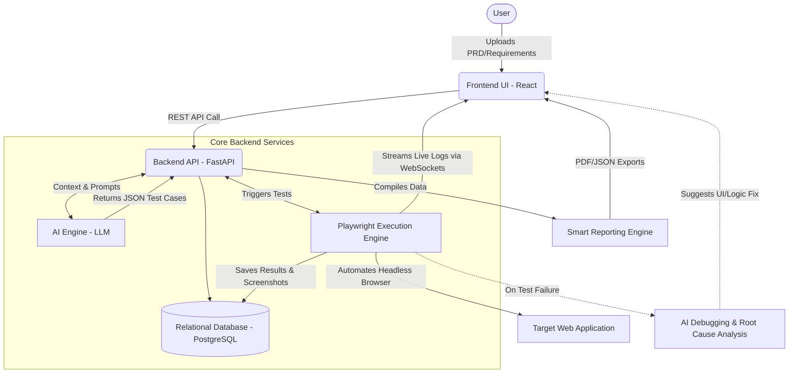
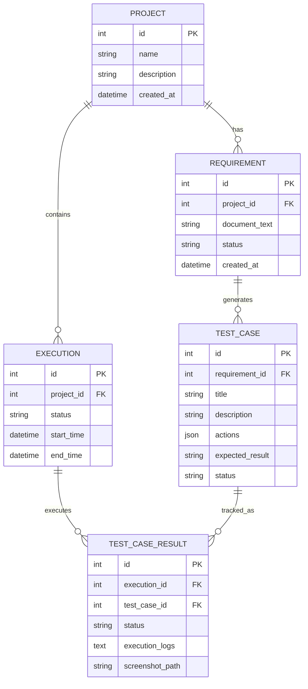
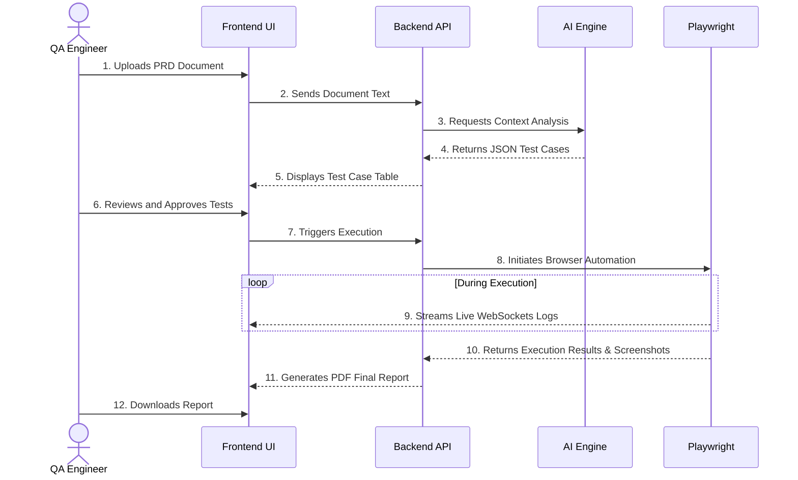

# AI-Based Test Automation Platform (AutoQA Enterprise)

AutoQA Enterprise is an advanced, end-to-end Artificial Intelligence (AI) driven Software Testing Life Cycle (STLC) platform. It bridges the gap between rapid software development and traditional Quality Assurance bottlenecks. By combining Large Language Models (LLMs) with dynamic browser automation tools, the platform autonomously handles requirement analysis, test case generation, live test execution, self-healing diagnostics, and comprehensive reporting.

---

## 1. Project Overview

AutoQA Enterprise automates the entire STLC process. It allows QA engineers, product managers, and developers to ingest raw requirements (such as PDFs or text), dynamically generate comprehensive test suites (covering both positive path and edge cases), run tests in real-time, view live execution logs via WebSockets, and export detailed PDF reports containing visual proof (screenshots) and diagnostics.

---

## 2. Problem Statement

In modern software development utilizing Agile and Continuous Integration/Continuous Deployment (CI/CD), software updates are shipped daily or even hourly. However, traditional QA processes suffer from:
* **Manual Translation Bottlenecks:** QA Engineers spend excessive time manually parsing Product Requirement Documents (PRDs) or Jira tickets to write test scripts.
* **Locator Fragility:** Traditional test frameworks (like Selenium or basic Playwright) rely on hardcoded CSS/XPath selectors. Minor UI changes break test suites, leading to massive maintenance overhead.
* **Lack of Actionable Debugging:** Standard pipelines output generic error codes on failure, requiring manual recreation of test states, log investigations, and debugging.

---

## 3. Features

* **Intelligent Requirement Ingestion:** Auto-parses unstructured document text and requirements using custom prompt chains to extract features, user roles, and execution scenarios.
* **Autonomous Test Case Design:** Generates structured, comprehensive test suites in strictly typed JSON format including negative scenarios and boundary values.
* **Dynamic execution with Playwright:** Interprets JSON test instructions on the fly and converts them to browser commands (click, fill, navigate, wait) without compiled code.
* **Real-time Live Monitoring:** Streams execution actions and console logs from the Playwright runner directly to the React interface over WebSockets.
* **Smart Reporting & Artifacts:** Compiles results, execution timings, pass/fail ratios, and failure screenshots into a professional, downloadable PDF report.
* **Visual Workflow Builder:** Drag-and-drop React Flow canvas to chain modular test cases into complex integration flows (e.g., User Login -> Add Item -> Checkout).

---

## 4. System Architecture

Decoupled, microservice-inspired architecture designed for high scalability and sub-second feedback loops.



### Database Entity-Relationship Diagram (ERD)



---

## 5. Technology Stack

| Component | Technology | Rationale |
| :--- | :--- | :--- |
| **Frontend Framework** | React.js (Vite) | Clean component structure, extremely fast builds and HMR. |
| **Styling** | Vanilla CSS / Tailored HSL | Custom dark/light mode UI with glassmorphic cards and dynamic transitions. |
| **Backend Framework** | FastAPI (Python 3.10+) | High performance, async support, auto-generated documentation, and Pydantic validation. |
| **Automation Engine** | Playwright (Python) | Modern browser automation with built-in auto-waiting and screenshot capture. |
| **Database** | PostgreSQL / SQLAlchemy | Relational integrity for projects, executions, and hierarchical test cases. |
| **Real-time Comms** | WebSockets | Ultra-low latency streaming of terminal output from test runner to UI. |
| **AI Processing** | OpenAI / Gemini API | Custom prompt templates to extract structured JSON from unstructured documents. |

---

## 6. Installation & Setup

### Prerequisites
* Python 3.10 or higher
* Node.js v18 or higher
* PostgreSQL Database instance

### Backend Setup

1. **Navigate to the Backend Directory:**
   ```bash
   cd backend
   ```

2. **Create and Activate a Virtual Environment:**
   ```bash
   python -m venv .venv
   source .venv/bin/activate  # On Windows: .venv\Scripts\activate
   ```

3. **Install Dependencies:**
   ```bash
   pip install -r requirements.txt
   ```

4. **Install Playwright Browsers:**
   ```bash
   playwright install
   ```

5. **Configure Environment Variables:**
   Create a `.env` file in the `backend/` directory:
   ```env
   DATABASE_URL=postgresql+asyncpg://<username>:<password>@localhost:5432/<dbname>
   OPENAI_API_KEY=your_openai_api_key_here
   GEMINI_API_KEY=your_gemini_api_key_here
   ```

6. **Initialize and Seed Database (Optional):**
   ```bash
   python seed.py
   ```

7. **Run the API Server:**
   ```bash
   uvicorn main:app --reload --host 0.0.0.0 --port 8000
   ```

---

### Frontend Setup

1. **Navigate to the Frontend Directory:**
   ```bash
   cd ../frontend
   ```

2. **Install Packages:**
   ```bash
   npm install
   ```

3. **Start the Development Server:**
   ```bash
   npm run dev
   ```
   The frontend will be available at `http://localhost:5173`.

---

## 7. Usage & Workflow Guide

1. **Create Project:** Open the dashboard and create a new project.
2. **Ingest Requirements:** Paste your PRD text or upload a requirement document. The AI Engine parses the text and displays generated test cases.
3. **Approve / Edit Cases:** Refine step actions and inputs directly in the human-in-the-loop validation console.
4. **Build Workflows:** Chain individual test scenarios inside the drag-and-drop workflow canvas to build end-to-end integration workflows.
5. **Execute Test Run:** Trigger execution. Watch the WebSocket terminal panel stream live actions from Playwright.
6. **Smart Reports:** View results, download branded PDF execution reports, and inspect screenshot captures for any failing steps.

---

## 8. Test Execution Flow

The STLC sequence below details how a document translates into a structured test run:



---

## 9. Screenshots & Samples

### Execution Failures & Diagnostics
AutoQA captures page screenshots exactly at the moment of failure to aid fast diagnostics.

*Example Failure Screenshot:*


*Example Generated Report (Sample):*
You can find the structural schema of generated PDF reports in the [backend/reports/](backend/reports/) directory (e.g. [report_95.pdf](backend/reports/report_95.pdf)).

---

## 10. Future Enhancements

* **Self-Healing Selectors:** Integrate AI computer vision to automatically detect UI moves/changes and resolve broken locators dynamically.
* **CI/CD Integration:** Custom GitHub Actions runner integration to execute test suites automatically on every git commit.
* **Mobile Cross-Platform Automation:** Expand Playwright config and Appium bindings to cover iOS and Android native app flows.
* **Load Testing Generator:** Automatically convert Playwright flow scripts into JMeter or Locust setups to stress-test APIs.
