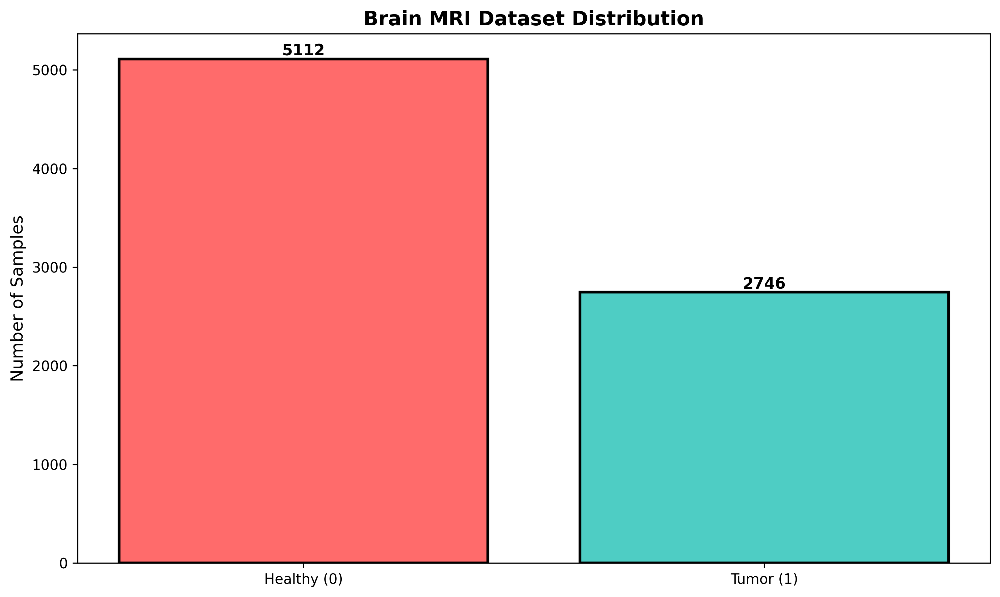
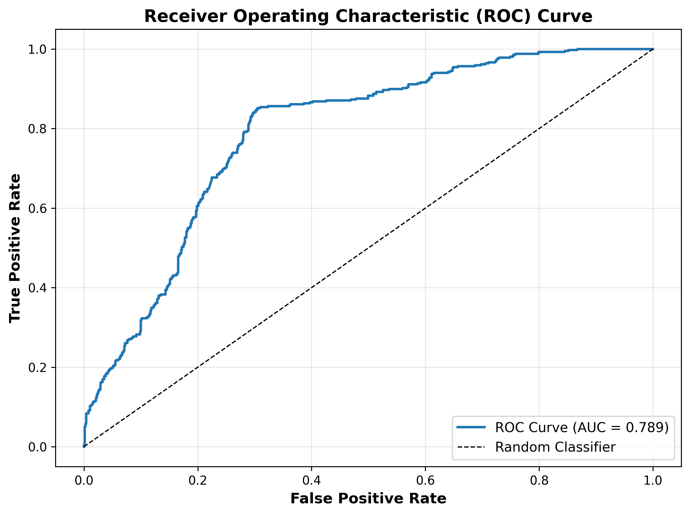
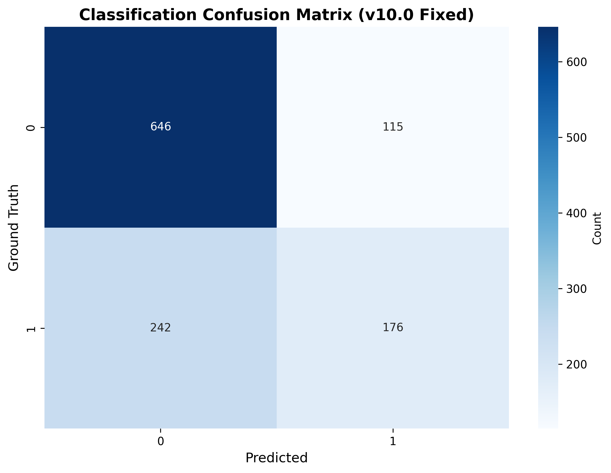

# 🧠 Brain Tumor Detection & Segmentation Dashboard

An end-to-end, medical image computer vision pipeline featuring a **Deep Convolutional Classifier with CBAM Attention** for tumor detection, and a **ResUNet Deep Segmenter** for boundary localization. The project includes a high-fidelity **Flask backend api** with background training/fine-tuning streams and a premium, responsive **React dashboard** for patient data exploration, interactive inference visualization, and real-time training analytics.

---

## 📋 Table of Contents
1. [Problem Statement](#-problem-statement)
2. [Dataset Information](#-dataset-information)
3. [Model Architecture](#-model-architecture)
   - [Tumor Detection (Classification)](#1-tumor-detection-classification)
   - [Tumor Boundary Localization (Segmentation)](#2-tumor-boundary-localization-segmentation)
4. [Technologies Used](#%EF%B8%8F-technologies-used)
5. [Project Directory Structure](#-project-directory-structure)
6. [Installation & Setup](#%EF%B8%8F-installation--setup)
7. [Usage Instructions](#-usage-instructions)
   - [Running the Core Pipeline](#1-running-the-core-pipeline)
   - [Starting the API Backend](#2-starting-the-api-backend)
   - [Launching the Frontend Dashboard](#3-launching-the-frontend-dashboard)
8. [Performance & Results](#-performance--results)
9. [Visualizations & Screenshots](#-visualizations--screenshots)

---

## 🔍 Problem Statement

Primary brain tumors are life-threatening conditions. Precise diagnosis and boundary delineation are critical for surgical planning, radiotherapy, and clinical monitoring. Manual slice-by-slice inspection of magnetic resonance imaging (MRI) scans by radiologists is time-consuming, subjective, and prone to fatigue-induced errors.

This project delivers a **two-stage computer vision framework** to automate this clinical workflow:
1. **Stage 1 (Classification)**: Scan patient MRI slices to instantly screen and classify slices into "Healthy" (no tumor) or "Tumor Detected".
2. **Stage 2 (Segmentation)**: For slices identified with tumors, run a deep semantic segmentation model to output high-accuracy pixel-level boundary masks, calculating the tumor area and boundary metrics.

Coupled with a **React-based dashboard**, clinicians can inspect patient MRI scans, view 3D brain slice volumes, trigger model retraining with custom hyperparameters, and run predictions in real-time.

---

## 📊 Dataset Information

The pipeline is trained and validated on the **LGG MRI Segmentation Dataset** (available on Kaggle).

* **Patient Volume**: Includes MRI scans from **110 unique patients** from the Cancer Genome Atlas (TCGA) lower-grade glioma collection.
* **Format**: MRI slices are provided in 16-bit grayscale TIFF formats, representing T1-contrast enhanced brain scans.
* **Annotations**: Ground-truth segmentation masks are provided for every tumor slice (manually delineated by expert readers).
* **Dataset Manifest**: The pipeline preprocesses the data to automatically compile a unified manifest tracking:
  * `patient_id`
  * `image_path`
  * `mask_path`
  * `mask` (binary label: 0 for healthy, 1 for tumor)

---

## 🏗️ Model Architecture

The core ML architecture employs a decoupled, two-stage deep neural network pipeline.

### 1. Tumor Detection (Classification)
* **Dynamic Backbones**: Supports multiple transfer-learning backbones including `ResNet50` (default), `EfficientNetV2-B0`, `DenseNet121`, and `ResNet50V2`.
* **Attention Mechanism (CBAM)**: Incorporates a **Convolutional Block Attention Module (CBAM)** after the feature extractor. CBAM sequentially infers attention maps along two separate dimensions:
  * **Channel Attention**: Focuses on "what" features are relevant (selecting critical MRI diagnostic channels).
  * **Spatial Attention**: Focuses on "where" the tumor is (localizing receptive fields within the slice).
* **Focal Loss**: Solves dataset imbalance (since healthy slices dominate) by training with Focal Loss:
  $$\text{FL}(p_t) = -\alpha_t (1 - p_t)^\gamma \log(p_t)$$
  This down-weights easy examples and forces the model to focus on hard, boundary-case slices.
* **Progressive Fine-Tuning**: Trains with frozen backbones initially and progressively unfreezes the last 25 layers during fine-tuning.

### 2. Tumor Boundary Localization (Segmentation)
* **ResUNet Architecture**: Combines the powerful encoder-decoder feature representation of U-Net with shortcut **Residual Blocks**. Residual blocks prevent gradient vanishing and allow deeper spatial feature abstraction.
* **Combined Loss Function**: The segmenter is compiled using a custom weighted loss combining:
  * **Focal Tversky Loss (70% weight)**: Optimizes boundary delineation by balancing false positives and false negatives (focusing heavily on recall to ensure no tumor regions are missed).
  * **Dice Loss (30% weight)**: Ensures structural similarity optimization and prevents the model from settling on the trivial "all background" solution (which causes U-Nets on medical images to freeze with an IoU of ~0.005).

---

## 🛠️ Technologies Used

### Backend & Machine Learning
* **Deep Learning Framework**: TensorFlow 2.x, Keras
* **Image Processing**: OpenCV, scikit-image, Pillow
* **Data Processing & Analytics**: NumPy, Pandas, scikit-learn
* **Web Server**: Flask, Flask-CORS
* **Concurrency**: Python Threading (for background training)

### Frontend Dashboard
* **Framework**: React 19, Vite
* **3D Visualizations**: Three.js, `@react-three/fiber`, `@react-three/drei` (renders slice sequences as 3D brain volumes)
* **Charts & Analytics**: Recharts, Plotly
* **Icons**: Lucide React
* **Styling**: Vanilla CSS

---

## 📂 Project Directory Structure

```directory
.
├── backend/
│   ├── app.py                      # Flask API endpoints (prediction, training state)
│   └── trainer.py                  # Background training worker & progress callbacks
├── data/
│   ├── processed/
│   │   └── dataset_manifest.csv    # Deduplicated preprocessed manifest (1.4MB)
│   └── raw/                        # Kaggle raw images directory (git-ignored)
├── frontend/
│   ├── public/                     # Icons & SVG resources
│   ├── src/
│   │   ├── assets/                 # SVGs and dashboard images
│   │   ├── components/             # Sidebar, 3D viewer, analyzer, trainer components
│   │   ├── App.css
│   │   ├── App.jsx                 # Dashboard orchestration
│   │   ├── index.css               # Main styling rules
│   │   └── main.jsx
│   ├── package.json
│   └── vite.config.js
├── models/                         # Logs & metadata (model weights are git-ignored)
│   ├── clf_training.log            # Training history for classifier
│   ├── seg_training.log            # Training history for segmenter
│   ├── clf_epochs_completed.txt    # Saved epochs tracker
│   └── seg_epochs_completed.txt
├── results/                        # Metrics report and evaluation figures
│   ├── predictions/                # Inference sample figures
│   ├── publication_figures/        # Paper-ready ROC, PR, and confusion matrix plots
│   ├── visualizations/             # Grid prediction figures
│   ├── FINAL_COMPREHENSIVE_REPORT.md
│   ├── class_distribution.png
│   └── tumor_overlay_visualization.png
├── main_pipeline.py                # Standalone pipeline (data split, train, eval)
├── requirements.txt                # Python dependencies
└── README.md                       # This document
```

---

## ⚙️ Installation & Setup

### Prerequisites
* Python 3.10+
* Node.js 18+
* GPU (Recommended for training, CPU supported for inference)

### 1. Clone the Repository
```bash
git clone https://github.com/YouvalKumar05/youval-projects.git
cd "youval-projects/Brain Tumor and Segmentation Project"
```

### 2. Python Environment Setup
```bash
# Create virtual environment
python3 -m venv .venv
source .venv/bin/activate

# Install dependencies
pip install -r requirements.txt
```

### 3. Frontend Dependencies Setup
```bash
cd frontend
npm install
cd ..
```

### 4. Dataset Configuration
To run training locally:
1. Download the **LGG MRI Segmentation Dataset** from Kaggle.
2. Place the unzipped folders (`kaggle_3m` and `lgg-mri-segmentation`) inside the `data/raw/` directory.

---

## 🚀 Usage Instructions

### 1. Running the Core Pipeline
To perform data parsing, manifest generation, train the classifier and segmentation models sequentially, and output metrics reports:
```bash
python main_pipeline.py
```

### 2. Starting the API Backend
The backend serves the saved model weights and handles live predictions, file streaming, and background training:
```bash
python backend/app.py
```
*Backend runs on: `http://localhost:5001`*

### 3. Launching the Frontend Dashboard
To run the interactive UI dashboard:
```bash
cd frontend
npm run dev
```
*Frontend runs on: `http://localhost:5173` (or the port displayed in your terminal)*

---

## 📈 Performance & Results

Below are the final evaluation metrics generated from testing the trained pipeline on the reserved test subset (**1,179 samples**).

### Classification Model (Detection)
| Metric | Value | Description |
| :--- | :--- | :--- |
| **Accuracy** | **69.72%** | Overall correct classification rate |
| **Weighted Precision** | **0.6840** | Combined precision weighted by class distribution |
| **Weighted Recall** | **0.6972** | Combined sensitivity rate |
| **ROC-AUC** | **0.7892** | Model discrimination power (Healthy vs Tumor) |
| **Healthy F1-Score** | **0.7835** | High reliability on healthy MRI slices (84.89% Recall) |
| **Tumor F1-Score** | **0.4965** | Balanced screening F1 score |

### Segmentation Model (Delineation)
Evaluation across **418 positive tumor test slices**:
* **Mean Dice Coefficient**: **0.9528 ± 0.0754** (Median: `0.9718`, 95% Confidence Interval: `[0.9455, 0.9600]`)
* **Mean Intersection over Union (IoU)**: **0.9170 ± 0.0971** (Median: `0.9451`)
* **Sensitivity (Recall)**: **0.9606 ± 0.0781**
* **Specificity**: **0.9990 ± 0.0014**
* **Precision**: **0.9470 ± 0.0856**

---

## 🖼️ Visualizations & Screenshots

Here are some of the generated key visualizations of the pipeline:

### 1. Dataset Balance
The dataset distribution shows the representation of healthy vs tumor slices:


### 2. Classification ROC Analysis
The ROC curve demonstrates the classifier's performance:


### 3. Classifier Confusion Matrix
Shows the details of True Positives, True Negatives, False Positives, and False Negatives:


### 4. Tumor Segmentation Overlays
High-fidelity boundary overlays showing the ResUNet predictions against ground truth masks:

*(Grayscale MRI slice (left), Ground Truth mask (middle), predicted ResUNet boundary overlay (right))*
